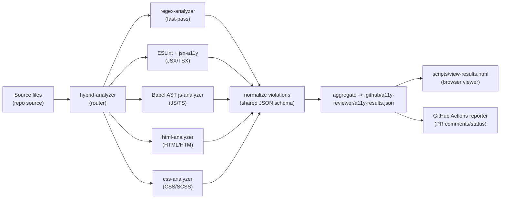
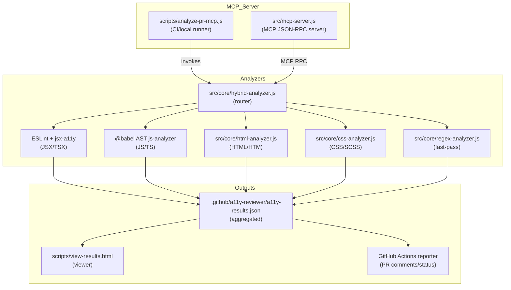

# Architecture — a11y-reviewer (project-wide)

This document describes the a11y-reviewer architecture: how the reviewer server, analyzers, scripts, CI integration, and viewer fit together. It includes diagrams that show the analysis pipeline and component relationships.

## Pipeline (high level)

The analyzer pipeline is optimized for two goals: fast triage across large repos and deep, contextual checks when feasible.

Key points:
- The hybrid router invokes the regex fast-pass first to provide quick, conservative findings and to handle files that may not parse.
- The hybrid router chooses one or more deep analyzers based on extension and file content (JSX detection, shebangs, file headers, etc.).
- All analyzers normalize into a shared JSON schema so downstream consumers (viewer, GitHub reporter) can rely on a single format.

## Component diagram

## Project responsibilities & flows

- `scripts/analyze-pr-mcp.js` — top-level entry used by CI or local scans; orchestrates a batch run and writes `.github/a11y-reviewer/a11y-results.json`.
- `src/mcp-server.js` — MCP server exposing JSON-RPC tools (`check_accessibility`, `check_accessibility_batch`, `suggest_fix`).
- `src/core/hybrid-analyzer.js` — main routing and orchestration for per-file decisions; integrates ESLint with `createRequire` and `resolvePluginsRelativeTo`.
- `src/core/regex-analyzer.js` — fast, low-dependency checks used for early feedback and as a fallback when parsing fails.
- `src/core/js-analyzer.js` — Babel AST-based semantic checks for runtime DOM manipulations and component patterns.
- `src/core/html-analyzer.js` — structural and ARIA checks using `htmlparser2`.
- `src/core/css-analyzer.js` — PostCSS-based visual/accessibility checks (contrast, focus styles, touch targets).
- Viewer: `scripts/view-results.html` + `scripts/view-results.sh` — serve and display `.github/a11y-reviewer/a11y-results.json` locally.
- CI: GitHub Actions workflow under `.github/workflows/accessibility-review.yml` calls the analyzer and uses the aggregated JSON to post PR comments and status checks.

## Data model and outputs

- Normalized output fields (see also `docs/DETECTION.md`): `ruleId`, `severity`, `message`, `line`, `column`, `wcag`, `fix`, `suggestions`, and `filePath`.
- Aggregated run file: `.github/a11y-reviewer/a11y-results.json` (overwritten each run).
- Consumers: viewer UI, GitHub Actions comments, PR status checks, and optional webhooks or integrations.

## Configuration and integration points

- `.a11y/config.json` (generated by `scripts/setup-integration.js`) configures rule enablement, severities, WCAG target, and ignore globs.
- Hybrid router exposes per-file overrides and extension hooks for maintainers to add custom routing logic.

## Extensibility & developer notes

- Adding rules: prefer implementing in the specialized analyzer for best precision; add a conservative regex entry only when parsing is not feasible.
- ESLint integration: the code uses the ESLint class API and resolves parser/presets via `createRequire` to support multiple project layouts.
- Tests: add unit tests under `tests/` for new rules and integration tests that run `scripts/analyze-pr-mcp.js` on sample fixtures.

